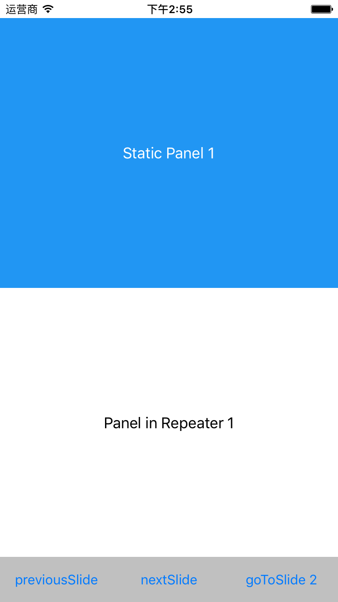

# nativescript-swiper

[](https://www.npmjs.com/package/nativescript-swiper)
[](https://www.npmjs.com/package/nativescript-swiper)


A NativeScript plugin for slide functionality on ios platform,based on ios native UIScrollView,quick response and high availability

## Why not android
As you know,slide functionality can made by "viewPager" component in native android devolop.And nativescript "TabView" component in android platform is a combination of a TabLayout widget and a ViewPager widget.So we can use nativescript "TabView" component as a slide by remove the title tab :`tabview._tabLayout.setVisibility(android.view.View.GONE);`

There is a discuss about this question: [TabView without the tabs](http://stackoverflow.com/questions/39019146/tabview-without-the-tabs/39025288#39025288)

### Screenshot:
[](https://www.youtube.com/embed/A2QqrXOESVA)

## Installation
`tns plugin add nativescript-swiper`


## Usage
`xmlns:Swiper="nativescript-swiper"`


## Example Usage:
### XML
```xml

	<Swiper:SwiperContainer 
            id="swiper-container"
            change="onChanged" 
            cancell="onCancelled" 
            start="onStart" 
            finish="onFinished">
        <Swiper:SwiperWrapper id="swiper-wrapper">
            <Swiper:SwiperSlide class="bg-blue" height="100%"  verticalAlignment="center">
                <Label text="Panel 1" color="#fff" textWrap="true" verticalAlignment="center" horizontalAlignment="center" />
            </Swiper:SwiperSlide>
            <Swiper:SwiperSlide class="bg-green" height="100%"  verticalAlignment="center">
                <Label text="Panel 2" color="#fff" textWrap="true" verticalAlignment="center" horizontalAlignment="center" />
            </Swiper:SwiperSlide>
            <Swiper:SwiperSlide class="bg-red" height="100%"  verticalAlignment="center">
                <Label text="Panel 3" color="#fff" textWrap="true" verticalAlignment="center" horizontalAlignment="center" />
            </Swiper:SwiperSlide>
        </Swiper:SwiperWrapper>
    </Swiper:SwiperContainer>

```

### Methods for SwiperContainer

- **nextSlide(animated : boolean)** - navigate to the right slide (if animated,transition with animate)
- **previousSlide(animated : boolean)** - navigate to the left slide (if animated,transition with animate)
- **goToSlide(index : number,animated : boolean)** : - goes to the slide at the specified index (if animated,transition with animate)
- **refresh()** - refresh the swiper when slides item changed(added slides,removed slides, or orientation changed),incase the currentIndex and slidesCount calculate Incorrectly.

### Attributes for SwiperContainer

-  **currentIndex : number** - get the current index of the slide (read only,start from 0).

### Events and EventData
* start - Start pan
     + object : The Observable instance that has raised the event.
     + eventName : The name of the event.
     + currentIndex : The current index of the slide (start from 0).
     + slidesCount : The count of all the slides.          
* changed - Transition complete
     + object : The Observable instance that has raised the event.
     + eventName : The name of the event.
     + preIndex : The old index of the slide that current slide transition from.
     + currentIndex : The current index of the slide (start from 0).
     + slidesCount : The count of all the slides.    
* cancelled - Transition not complete 
     + object : The Observable instance that has raised the event.
     + eventName : The name of the event.
     + currentIndex : The current index of the slide (start from 0).
     + slidesCount : The count of all the slides.    
* finished - Last slide has come into view
     + object : The Observable instance that has raised the event.
     + eventName : The name of the event.
     + currentIndex : The current index of the slide (start from 0).
     + slidesCount : The count of all the slides.    
* scroll - the SwiperContainer is scroll (will fire many times)
     + object : The Observable instance that has raised the event.
     + eventName : The name of the event.
     + scrollX : The horizontal offset of the SwiperContainer ScrollView.
     + slidesCount : The count of all the slides.       


### work with Repeater
nativescript-swiper can easily work with Repeater


```xml

	<Swiper:SwiperContainer >
              <Repeater items="{{ items }}">
                  <Repeater.itemsLayout>
                      <Swiper:SwiperWrapper />
                  </Repeater.itemsLayout>
                  <Repeater.itemTemplate>
                      <Swiper:SwiperSlide height="100%" verticalAlignment="center">
                          <Label text="{{ 'Panel in Repeater ' + ($value + 1) }}" color="#000" textWrap="true" verticalAlignment="center" horizontalAlignment="center" />
                      </Swiper:SwiperSlide>
                  </Repeater.itemTemplate>
              </Repeater>
          </Swiper:SwiperContainer>   

```

``` javascript

	var Observable = require("data/observable").Observable;
	
	var source = new Observable();
    var items = [];
    for(var i = 0;i < 10;i++){
        items.push(i);
    }
    source.set("items", items);
    page.bindingContext = source;
    
```

### Add or Remove slides dynamically

Only need to add/remove SwiperSlide item to the SwiperWrapper in any time you want

``` javascript

	var platformModule = require("platform");
	var swiperWrapper = page.getViewById("swiper-wrapper");
	
	var SwiperSlide = require("nativescript-swiper").SwiperSlide;
    var newSwiperSlideItem = new SwiperSlide();
    newSwiperSlideItem.height = "100%";
    newSwiperSlideItem.backgroundColor = "#000";
    newSwiperSlideItem.verticalAlignment = "center";
    var LabelModule = require("ui/label");
    var label = new LabelModule.Label();
    label.text = "this is a new SwiperSlide item,tap to remove it";
    label.color = "#fff";
    label.verticalAlignment = "center";
    label.horizontalAlignment = "center";
    newSwiperSlideItem.addChild(label);
    
    swiperWrapper.addChild(newSwiperSlideItem);
    label.on('tap',function(args){
        swiperWrapper.removeChild(newSwiperSlideItem);
    });
    
```

### Handles application orientation change

when application orientation changed,the slides shold change it's width to fill the screen

add this code into page navigatedTo event


``` javascript

	var app = require('application');
	var swiperContainer = page.getViewById("swiper-container");
	var swiperWrapper = page.getViewById("swiper-wrapper");
	app.on(app.orientationChangedEvent, function (args) {
        setTimeout(function() {
            swiperWrapper.eachLayoutChild(function(slide){
                slide.width = platformModule.screen.mainScreen.widthDIPs;
                swiperContainer.refresh();
            })
        }, 10);
    })
	    
```


#### Imperfect currently,will iterative soon,welcome contributors and issues


## License

[MIT](/LICENSE)
